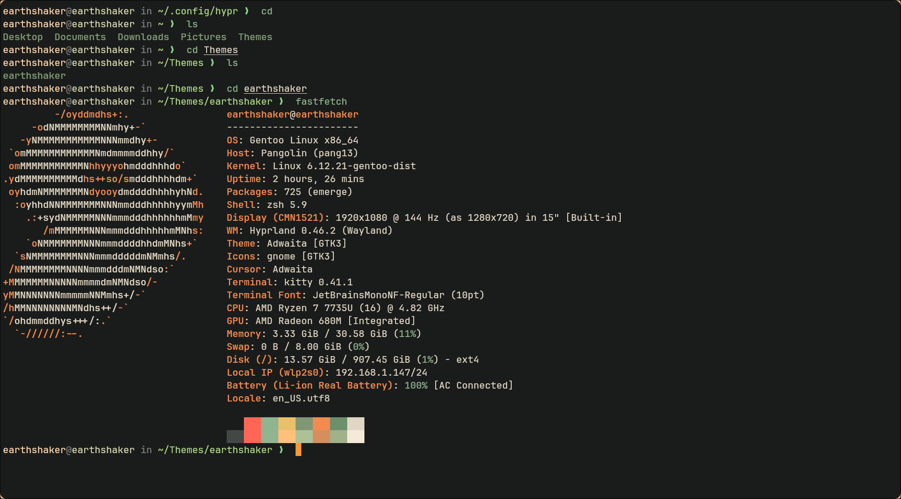

# Earthshaker ZSH Theme

A minimalist, earthy ZSH theme designed for developers who prefer warmth,
subtle power, and a grounded aesthetic. Built by **Remus Alexander**.
*Earthshaker* evokes quiet confidence, intentional design, and just a hint of lore.

---

## 🌱 Features

- Clean single-line prompt
- Shows current working directory
- Git branch with clean/dirty status
- Earthtone color palette
- Supports Oh My Zsh
- No newlines, no clutter

---

## 🎨 Color Highlights

| Element       | Color Code | Description         |
|---------------|------------|---------------------|
| User/Host     | #d8c8b3  | Warm parchment      |
| Directory     | #deb769  | Golden amber        |
| Git Branch    | #e49b5d  | Burnt copper        |
| Dirty Branch  | #f3b87a  | Bright ochre        |
| Clean Branch  | #708271  | Moss green (✓)      |
| Divider Text  | #888878  | Soft stone gray     |

---

## ⚙️ Installation

1. Clone or copy the theme file:

```bash
curl -o ~/.oh-my-zsh/themes/earthshaker.zsh-theme \
  https://raw.githubusercontent.com/remusearthshaker/earthshaker.zsh/main/earthshaker.zsh-theme
```

2. Enable it in your `.zshrc`:

```bash
ZSH_THEME="earthshaker"
```

3. Reload Zsh:

```bash
omz reload
```

> ✅ Requires the `git` plugin enabled in your plugin list:

```bash
plugins=(git)
```

---

## Screenshots



> screenshot shown with [earthshaker.kitty](https://github.com/remusearthshaker/earthshaker.kitty)
> and [earthshaker.hyprland](coming soon!)

---

## 📜 License

Licensed under the MIT License. Use, fork, customize — just keep the vibes alive.

---

## 🌀 Part of the Earthshaker Ecosystem

This theme is part of the [Earthshaker.nvim](https://github.com/remusearthshaker/earthshaker.nvim) aesthetic toolkit.

Pair it with:

- [earthshaker.nvim](https://github.com/remusearthshaker/earthshaker.nvim)
- A nice forest wallpaper 🌲

May your shell feel rooted.
